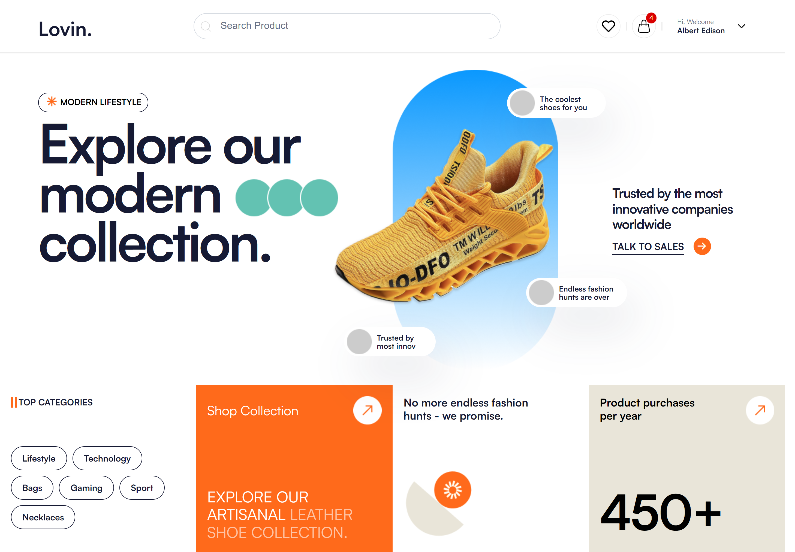

# Lovin. - Modern Lifestyle Collection


Welcome to the Lovin. project repository! This project showcases a modern and stylish web page for a lifestyle and fashion collection. The design emphasizes a clean layout with a focus on featured products and categories.

## Features

- **Modern Lifestyle Collection**: Explore a variety of modern and trendy items.
- **Top Categories**: Easily navigate through different categories like Lifestyle, Technology, Bags, Gaming, Sport, and Necklaces.
- **Highlighted Products**: Special focus on unique and cool products.
- **User-Friendly Interface**: Clean and easy-to-navigate design.

## Screenshot

The following screenshot provides a preview of the web page design:

- Home Page


## Getting Started

To run this project locally, follow these steps:

1. **Clone the repository**:
    ```bash
    git clone https://github.com/your-username/assaignment-12-jun-24.git
    ```
2. **Navigate to the project directory**:
    ```bash
    cd lovin-project
    ```
3. **Open the HTML file in your browser**:
    - Open `index.html` with your preferred web browser.

## Contributing

We welcome contributions to enhance this project. To contribute:

1. Fork the repository.
2. Create a new branch (`git checkout -b feature-branch`).
3. Make your changes.
4. Commit your changes (`git commit -m 'Add some feature'`).
5. Push to the branch (`git push origin feature-branch`).
6. Open a Pull Request.

## License

This project is licensed under the MIT License - see the [LICENSE](LICENSE) file for details.

## Contact

For any questions or feedback, feel free to reach out.

---

Enjoy exploring the Lovin. collection!

